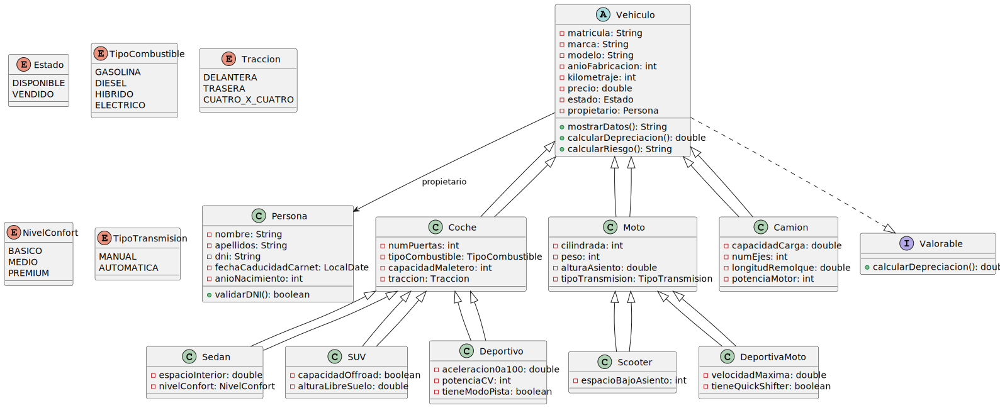

# UT5_ED_Prog

## ✔️ Checklist de tareas

- [x] Crear estructura base del repositorio
- [x] Definir clases y relaciones UML
- [ ] Implementar clases Java
- [ ] Añadir lógica de negocio (riesgo, depreciación)
- [ ] Probar aplicación de consola
- [ ] Documentar funcionamiento

## 📊 Diagrama de clases

